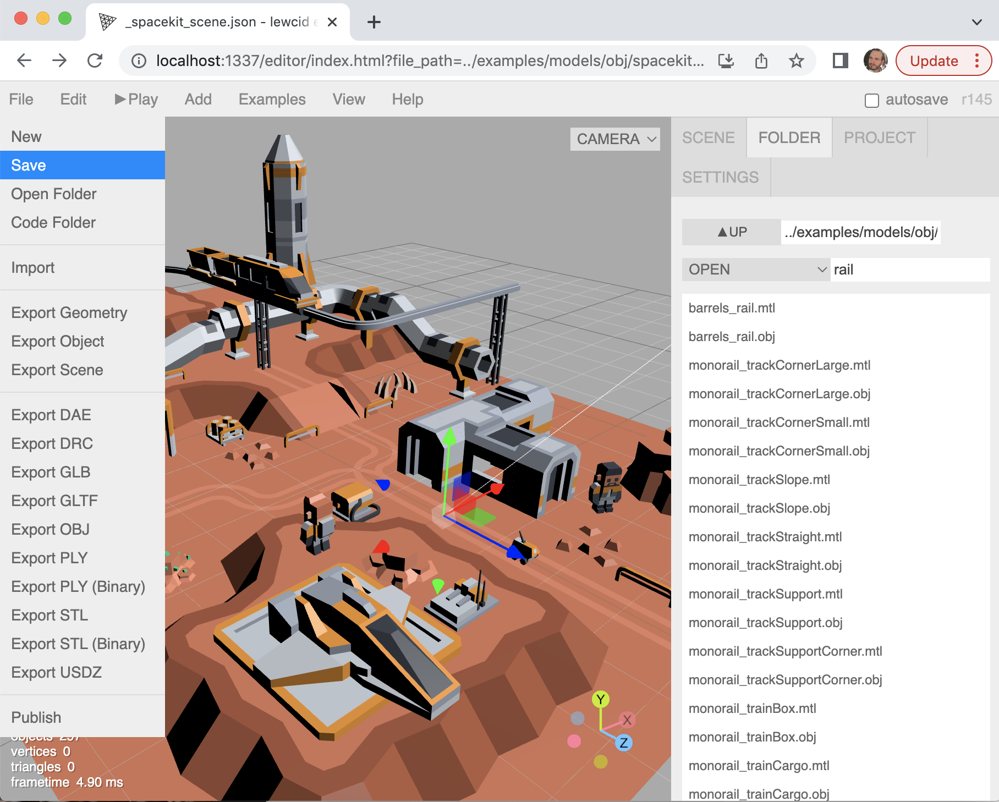
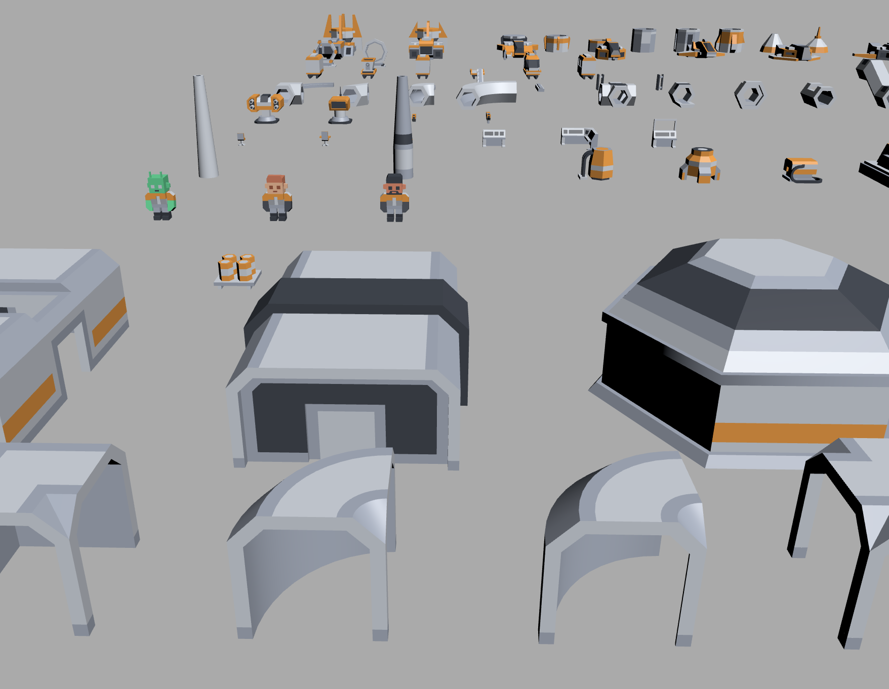

# Lewcid Editor

Lewcid Editor is an adaptation of the three.js editor to run locally,
like a traditional file-based 3D editor, while maintining it's online capabilities. It is listed as this bug on the main three.js website: https://github.com/mrdoob/three.js/issues/24766 

Based on [three.js](https://threejs.org/)'s [editor source code](https://github.com/mrdoob/three.js). Changes are in the 'local_editor' branch: https://github.com/leweyg/lewcid_editor/compare/dev...local_editor 

## Examples 

Scene assembled in Lewcid Editor :
https://leweyg.github.io/lewcid_editor/editor/index.html?file_path=../examples/models/obj/spacekit/a_spacekit_scene.json 

Kenney.nl's Space Kit in Lewcid Editor :
https://leweyg.github.io/lewcid_editor/editor/index.html?file_path=../examples/models/obj/spacekit/a_spacekit_all.json 

## Features (ALL IN PROGRESS)
- **'Folder' tab** to quick browse/search/open/instance/manage large collections of files, including for the example three.js content itself. Default scenes (with lights) provided for images, materials, etc.
- **Local System App** for File Open/Save, launching local file-explorer or code/asset editors, basic git commands, etc. URL-based path selector allows different content per-tab etc.
- **Path-based Scenes** for scenes whose content is referenced via file paths (to models, materials, sub-scenes, scripts, etc.) rather than within the file itself. Also builds into project-wide optimization tools like material unification, dependancy-based asset builds, and possibly support for importing or editing-in-place whole projects from Unity/Unreal/Godot.
- **Fully WASD Camera** for improved navigation through complex scenes at different scales.
- **Basic Animation Timeline Editor** for setting up automatic or scripted animation timelines.
- **Browser-based 3D Editor**: most existing three.js editor features such 3D scene import/authoring/export (GLTF/OBJ/FBX/etc.) including models/lights/scripts etc.

## Short term setup:
- Clone the git locally and run './host_editor_php.sh' for Mac/Linux, or similar for Windows.

## Longer term:
- To be compiled into a standalone electron-type app to run natively on most platforms.

